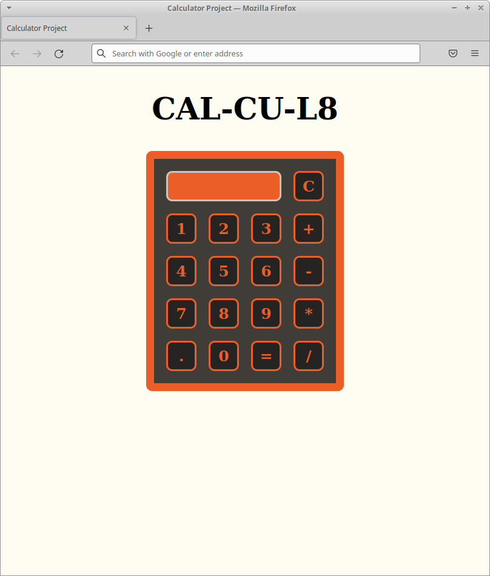

# calculator

This project is an implementation of an on-screen calculator. The outline for the project can be found [here.](https://www.theodinproject.com/paths/foundations/courses/foundations/lessons/calculator)

# Current Version

A demo of the app can be found [here.](https://thejulianflores.github.io/calculator/)

This app is a basic four-function calculator. The following is a basic feature list:

1. Full keyboard and mouse support
2. Multi-operator support
3. Floating point support

# Part 1: Understanding the Project

The finished product will be an on-screen calculator that will take two values and an operation. The user may choose between:

1. Addition
2. Subtraction
3. Multiplication
4. Division

Once the user clicks on the "=" button, the operation will be used on the numbers input. The resulting number will be displayed on the top of the GUI. 

The user is able to string together several operations at once without using the "=" key. The operations will work once the second operation is chosen. 